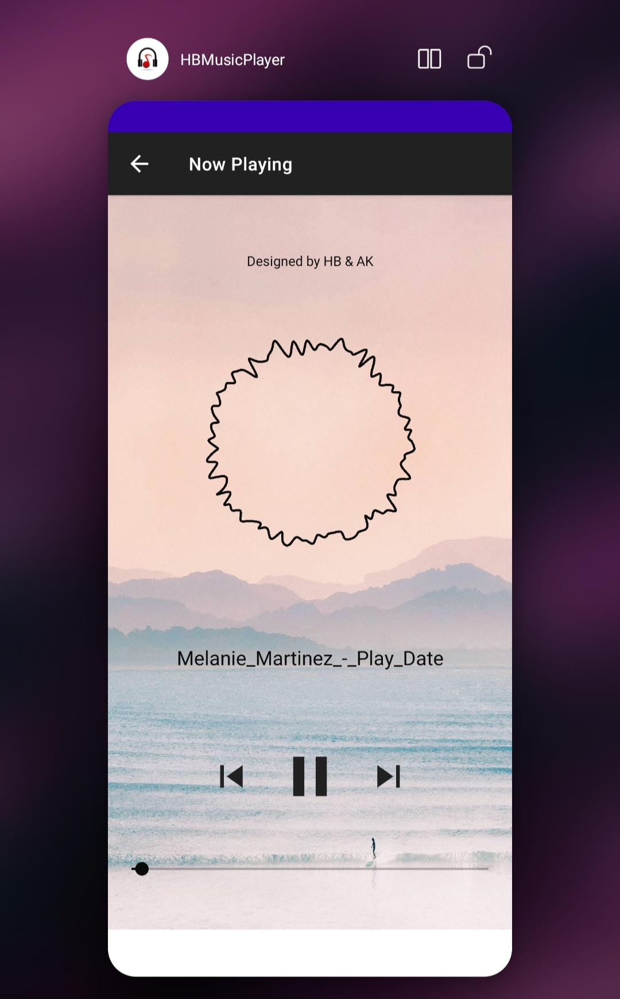

# 🎵 HB Music Player (Android)

A simple, clean, and functional **Android Music Player App** built using **Java** and **XML**.
This app allows users to play, pause, skip, and control volume and playback position of local audio files with an elegant UI.

Designed by **Harishchandra Bansode & Abhishek Kadu**.

---

## 📱 App Preview

---

## 🚀 Features

* ▶️ Play / Pause music
* ⏮ Previous & ⏭ Next song controls
* 🎚 SeekBar for song progress
* 🔊 Volume control using SeekBar
* 🖼 Dynamic album art
* 🎶 Song title display
* 📂 Plays local audio files stored in `res/raw`
* 🎨 Simple & modern UI

---

## 🛠 Tech Stack

| Component      | Technology              |
| -------------- | ----------------------- |
| Language       | Java                    |
| UI Design      | XML                     |
| Media Playback | Android MediaPlayer API |
| IDE            | Android Studio          |
| Min SDK        | Android 5.0+            |

---

## 🧠 How It Works

* Songs are stored in an `ArrayList<Integer>`
* MediaPlayer loads songs by index
* `SeekBar` tracks playback progress
* Volume control uses `AudioManager`
* Background thread updates seekbar every second
* `ImageView` changes dynamically based on song

---

## 🖥 UI Components

* `ImageView` → Album Art
* `TextView` → Song Title
* `SeekBar` → Song progress
* `SeekBar` → Volume
* `ImageView Buttons` → Play / Pause / Next / Prev
---

## 🧩 Dependencies

No external libraries required.
Uses built-in Android APIs only.

---

## 📜 License

This project is open-source and free to use for learning and personal projects.

---

